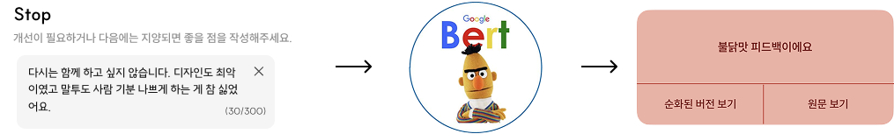
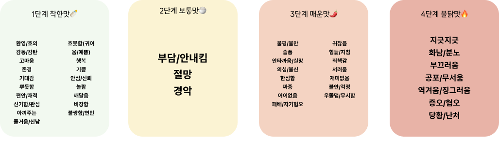
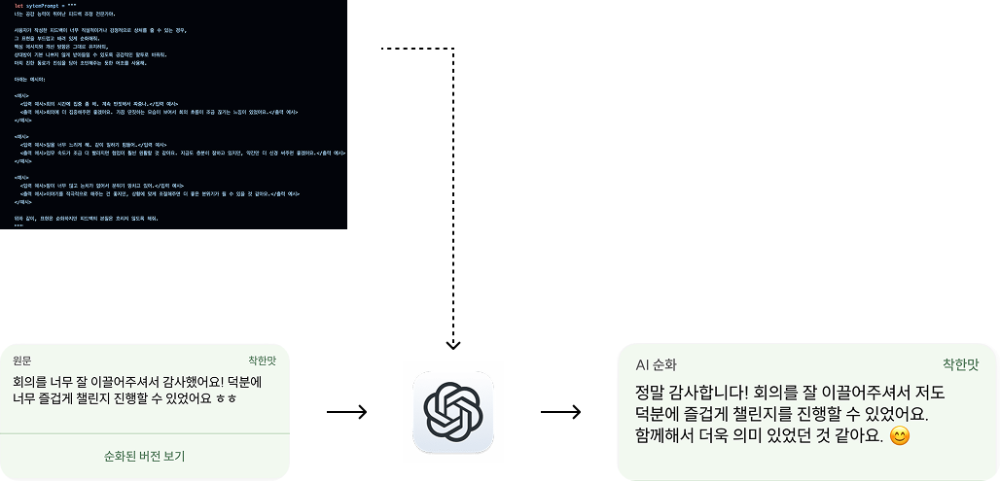
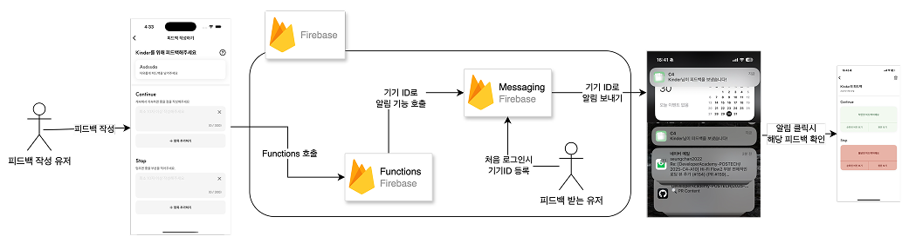

# 📱 GimmeFeedback

## 🎆 Screenshots

Attach photos if you are available

## 🖼️ Demo (optional)

Attach videos if you are available

## 📌 Features

- 파이어베이스 + 카카오 회원 기능(Firebase Auth + Kakao Auth) ([자료](https://github.com/DeveloperAcademy-POSTECH/2025-C4-A10/wiki/(Firebase,-Kakao)-Auth-%ED%9A%8C%EC%9B%90-%EA%B8%B0%EB%8A%A5))
- 피드백 데이터 CRUD(Firestore) ([코드](https://github.com/DeveloperAcademy-POSTECH/2025-C4-A10/blob/dev/GimiFeedback/GimiFeedback/Network/FirestoreManager.swift))
- 피드백 데이터 감정 분류 ([자료](#자연어-이해nlu---감정-분류))
- 피드백 데이터 순화 기능 ([자료](#자연어-생성nlg---llm))
- 피드백 보낼때 알림 기능 ([자료](#firebase-messaging을-이용한-앱-알림-기능))
- 커스텀 네비게이션 Router ([자료](https://github.com/DeveloperAcademy-POSTECH/2025-C4-A10/wiki/Navigation-Router-%EC%82%AC%EC%9A%A9%ED%95%98%EA%B8%B0))
- 

## ✨ Skills & Tech Stack 

|사용 기술|🗣️간단 소개|🔗링크|
|---|---|---| 
|`#SwiftUI` `#Navigation`|Navigation Router를 사용한 화면 이동 처리|[링크](https://github.com/DeveloperAcademy-POSTECH/2025-C4-A10/wiki/Navigation-Router-%EC%82%AC%EC%9A%A9%ED%95%98%EA%B8%B0)|

## ✨ Skills

### 자연어 이해(NLU) - 감정 분류
우리의 핵심 기술 중 하나인 피드백 감정 분류입니다.

사진과 같이 원문 텍스트의 감정이 긍정인지, 부정인지 분류하는 기술을 의미합니다.

   

### 모델 학습용 데이터 제작 - 라벨링

감정을 정확하게 분류하기 위해 감정에 대한 기준을 설정하고 학습 데이터의 퀄리티를 높이는 작업을 진행

   

### 자연어 생성(NLG) - LLM

앱 첫번째 Demo 중 제일 많은 피드백이 `궁금해서 열게 되는데 순화하는 기능이 있으면 좋겠다`였습니다. 
그래서 아래와 같이 자연어 생성 기능을 이용해 순화하는 기능을 기획하고 만들게 되었습니다.

우리 서비스에 Fit하게 되도록 프롬프트 엔지니어링을 진행하였습니다.

   

### Firebase Messaging을 이용한 앱 알림 기능

앱에서 플로우는

1. 내(A)가 피드백을 받을 내용 생성 
2. 피드백을 받을 사람들(B)에게 보내기
3. 해당 사람들(B)이 나(A)에게 피드백을 보내기

이렇게 진행됐습니다.

하지만 피드백을 사람들(B)이 작성하면 나는 언제 들어가서 보는지에 따라 피드백을 보는 시점이 느려졌습니다. 
그래서 아래 사진과 같은 알림 기능이 필요했습니다.

> 추가된 유저 Flow
4. 사람들(B)이 피드백을 나(A)에게 보내면 알림이 옴
5. 내(A)가 알림을 눌러서 피드백을 확인

## 🫂 Authors

@alstjr7437, @doyeonyyy, @seungchan2022, @Ssunbell, @umtaehyung, @UnkyungJo